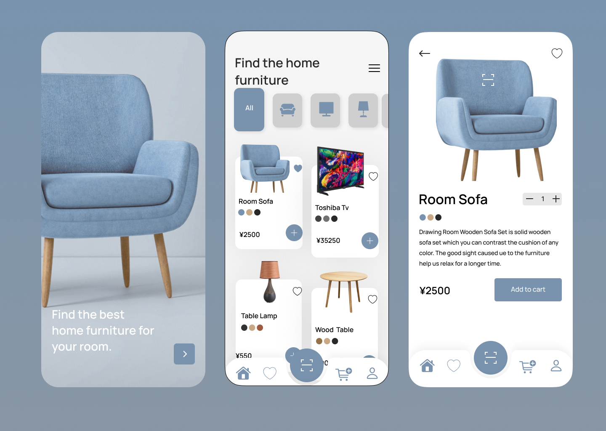

# Furniture Store App UI - Flutter

This is a beautifully designed Furniture Store App UI built using Flutter. The app is structured following the Model-View-Controller (MVC) architecture to ensure clean and maintainable code.

## Features

- A welcoming start screen with a user-friendly arrow button to navigate to the home page.
- A dynamic home screen showcasing product lists and personalized suggestions.
- An interactive product page that presents detailed information about each product, including name, price, description, color palette, and multiple pictures.

## Screens

1. **Home**: The home page displays various furniture categories and popular products.

2. **Product Page**: The product page offers in-depth details about each furniture item, providing a comprehensive view of the product's features and design.

## How to Run

1. Ensure that you have Flutter installed on your development machine.

2. Clone this repository to your local machine.

3. Open the project in your preferred code editor.

4. Run the following command in the terminal to install the required dependencies:
   ```
   flutter pub get
   ```

5. Connect your device or start an emulator.

6. Run the app using the following command:
   ```
   flutter run
   ```

## Screenshots



## UI Design

The UI design of this app focuses on creating an immersive and elegant shopping experience for users. The color palette and typography have been thoughtfully chosen to evoke a sense of luxury and sophistication. Careful attention to image selection and icon placement enhances the overall user experience, encouraging users to explore the extensive furniture collection.

## Libraries Used

This project utilizes the following libraries:

- `flutter_svg`: To display SVG images seamlessly within the app.
- `google_fonts`: To incorporate custom Google Fonts for a unique and cohesive typography design.

## Contribution

Contributions are more than welcome! If you encounter any issues or have suggestions for improvements, feel free to open an issue or submit a pull request. Your contributions will be greatly appreciated and will help make this Furniture Store App even better.
